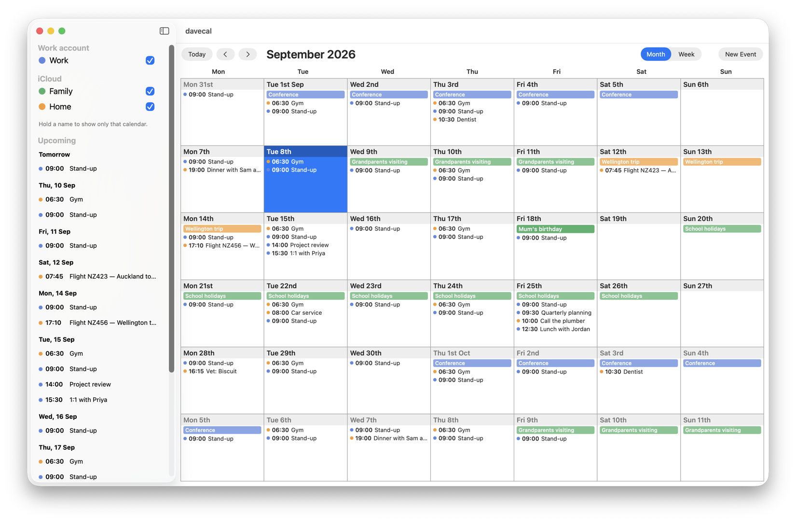

# davecal

A small native macOS calendar written for my own use. The aim is to be
easier for me to read than the built-in Calendar app.

### Completely vibe-coded. YMMV

It works on the accounts already set up in macOS Calendar (iCloud, Fastmail,
Microsoft 365 and so on) through Apple's EventKit, so it has no account setup
of its own and everything it saves shows up everywhere else.



## Installing a release

Needs macOS 15 or later on an Apple Silicon Mac.

1. Download `davecal.zip` from the latest release and unzip it.
2. It isn't signed with an Apple developer certificate, so macOS will refuse
   to open it until the download flag is cleared:

   ```bash
   xattr -d com.apple.quarantine ~/Downloads/davecal.app
   ```

3. Move `davecal.app` to Applications and open it. macOS asks for calendar
   access on first launch.

## Building from source

Needs the Swift toolchain (Xcode or the Command Line Tools).

```bash
make run
```

That builds a release binary, wraps it as `davecal.app` with an ad-hoc
signature, and opens it. `make release` produces `davecal.zip`.

To run with made-up events instead of your own, for screenshots:

```bash
make demo
```

## Licence

Public domain, under [The Unlicense](LICENSE).
